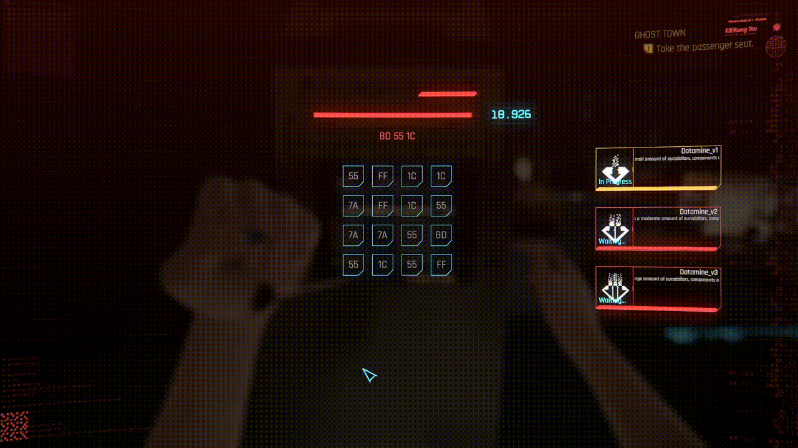

# Disclaimer

*Please note that this mod is still in beta and not yet ready for full publication. What you see here is a preview of the mod and a lot of things can change before (real) nexus release (if it ever gets released)*

# Requirements

- Game (2.1)
- [CET](https://www.nexusmods.com/cyberpunk2077/mods/107)
- [Redscript](https://github.com/jac3km4/redscript)
- [CustomHackingSystem](https://github.com/ElysiumRL/CustomHackingSystem)
- [Codeware](https://github.com/psiberx/cp2077-codeware)

# Install

Drag & Drop the "Minigames" folder inside of the CustomHackingSystem redscript files (in r6/scripts/)

You should have the following tree structure (starting from r6 folder) :
```
├── r6
│   ├── scripts
│   │   ├── CustomHackingSystem
│   │   │   ├── Minigames
│   │   │   │   ├── PatternRecognition
│   │   │   │   │   ├── mod stuff ...
│   │   │   │   ├── BaseWidget.reds
│   │   │   │   ├── CustomMinigame.reds
│   │   │   │   ├── ...
```

# Pattern Recognition Minigame


This custom hacking minigame is entirely made with [Redscript](https://github.com/jac3km4/redscript) using [Codeware](https://github.com/psiberx/cp2077-codeware) and with the ***HUGE*** help of [Ink Playground](https://github.com/psiberx/cp2077-playground)

## What is it ?
Inspired by [this minigame](https://sharkiller.ddns.net/nopixel_minigame/hackingdevice/) from GTA5 RP, the objective is simple : Find the marked pattern in an ever-moving wrapping grid.
The minigame is split in multiple instances, each instance being tied to an unlockable program.
- Each correct pattern guess unlocks a program
- Each mistake locks the program, making it unavailable
- The minigame is considered "Succeeded" if you unlock at least one program
- The minigame is considered "Failed" if no programs are unlocked

A minigame instance has 2 moving timers during it's life cycle :
- the Game Timer (the large moving bar) - Triggers instance failure if you run out of time
- Pattern Moving timer (the small one) - moves the grid to the left on timer end



# Beta
As you may have probably realized, this is a beta, a lot of small parts of the minigame (especially decorative parts) haven't been polished yet. this includes possible UI bugs & possible mod incompatibilities. The UI has currently been tested using Windowed Fullscreen - 1080p resolution. I don't know the possible issues with other (possibly bigger) monitors/bigger resolution

As of 2.1 patch, there are also some framerate issues not yet found

## Debug
In order to access the minigame you can :
- Start hacking any access point
- (DEBUG) : Hold "Choice_2" Button (Secondary Interaction button). Requires "Debug Mode" activated in Mod Settings (CustomHackingSystem row)

## Missing Features
These are the features that have yet to be made before full release
- Introduction Video Skip
- Button Hints & Tutorial tab
- Random programs
- More Pattern types
- Random settings
- Localization support
- User Hints on failed compilation

# Special Thanks
- jekky - [Redscript](https://github.com/jac3km4/redscript)
- yamashi - [CET](https://www.nexusmods.com/cyberpunk2077/mods/107)
- psiberx - [Codeware](https://github.com/psiberx/cp2077-codeware) + [Ink Playground](https://github.com/psiberx/cp2077-playground) + many many more useful mods
- The entire [CP77 Community Discord](https://discord.gg/Epkq79kd96) (for making awesome mods and providing very good informations in the channels)

# Contributing
Pull requests / Issues should be opened for any kind of contributions
